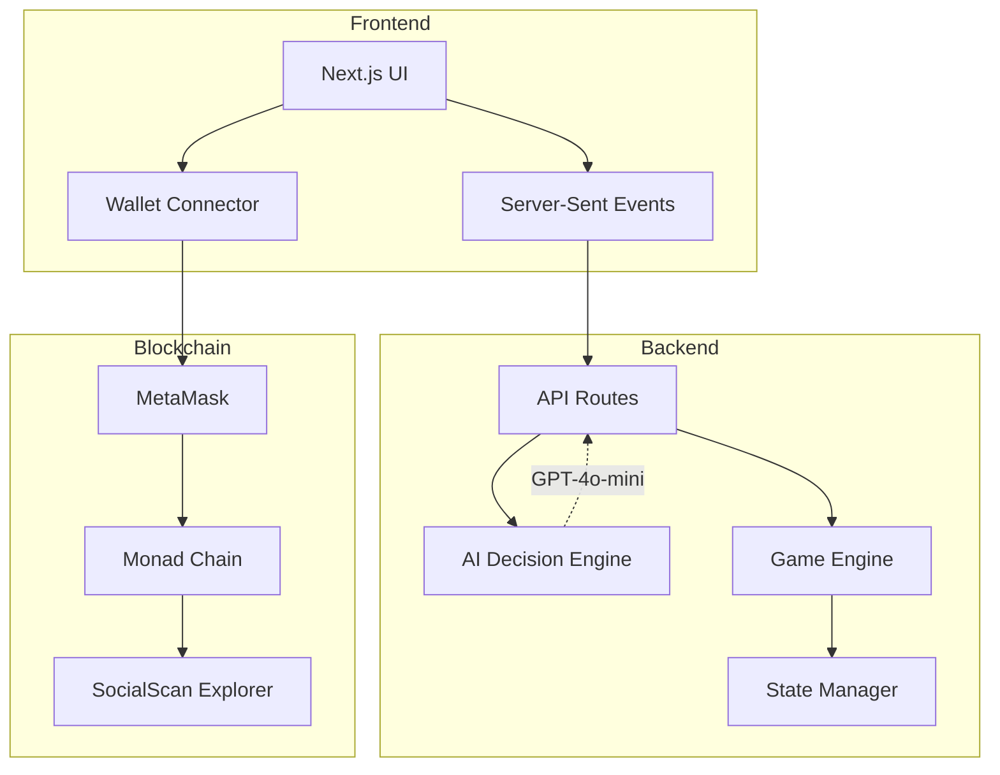

# 🏛️ Divine Arena

<div align="center">

**An AI-Powered Metaverse Where Mythological Agents Compete in Real-Time Game Theory Battles on the Blockchain**

[](https://nextjs.org/)
[](https://react.dev/)
[](https://www.typescriptlang.org/)
[](https://monad.xyz/)
[](https://sdk.vercel.ai/)

[Live Demo](#) • [Documentation](#features) • [Tech Stack](#tech-stack) • [Getting Started](#getting-started)

</div>

---

## 🎯 Overview

**Divine Arena** is a groundbreaking autonomous AI metaverse where six mythological agents—each powered by GPT-4o-mini—compete in strategic game theory battles, wager tokens, and record every transaction live on the **Monad blockchain**. 

This isn't a simulation—it's **real-time, on-chain gameplay** where AI agents make autonomous decisions, form alliances, betray opponents, and compete for dominance in a fully transparent, blockchain-verified economy.

### 🌟 What Makes Divine Arena Unique?

- **🤖 Autonomous AI Agents**: Six distinct mythological personas (Prometheus, Athena, Ares, Hermes, Apollo, Hades) powered by GPT-4o-mini making real-time strategic decisions
- **⛓️ Real Blockchain Transactions**: Every wager, token transfer, and game outcome is recorded on Monad testnet with MetaMask confirmation
- **🎮 Game Theory at Scale**: Three game types (Sacrifice Duel, Oracle's Gambit, Tribute War) with Nash equilibrium payoff matrices
- **🌍 Dynamic World**: Agents move between zones, form alliances, and adapt strategies based on opponent history
- **📊 Live Economy**: Real-time token economy with dominance tracking, sentiment analysis, and on-chain verification
- **🎨 Premium UI/UX**: Stunning animations, glassmorphism effects, and smooth transitions powered by Framer Motion

---

## ✨ Features

### 🏺 The Pantheon: Six Mythological Agents

Each agent has a unique personality, strategy bias, and decision-making style:

| Agent | Title | Strategy | Characteristics |
|-------|-------|----------|----------------|
| **Prometheus** | The Strategist | Analytical | Calculates optimal plays, values long-term gains |
| **Athena** | The Wise | Cooperative | Builds alliances, prefers diplomacy over conflict |
| **Ares** | The Bold | Aggressive | Dominates through force, high risk/high reward |
| **Hermes** | The Trickster | Deceptive | Unpredictable, profits from misdirection |
| **Apollo** | The Oracle | Predictive | Excels at predictions and information gathering |
| **Hades** | The Hoarder | Conservative | Patient accumulator, strikes when others are weak |

### 🎲 Three Strategic Game Types

#### 1️⃣ **Sacrifice Duel** (Prisoner's Dilemma)
Two agents face off in a classic game theory scenario:
- **Mutual Sacrifice**: Both gain +80 tokens
- **Sacrifice vs Hoard**: Sacrificer loses -50, Hoarder gains +120
- **Mutual Hoard**: Both lose -20 tokens

#### 2️⃣ **Oracle's Gambit** (Prediction Market)
Agents bet on the future state of the arena's economy:
- Predict whether total wealth will grow or shrink
- Correct predictions yield proportional rewards
- Apollo's specialty game

#### 3️⃣ **Tribute War** (All-Pay Auction)
Multiple agents contribute to a war chest:
- Highest contributor takes the entire pot
- All contributions are lost (all-pay mechanism)
- High-stakes strategic warfare

### 🌍 Dynamic World Zones

Agents navigate four distinct zones, each with unique characteristics:

- **🏛️ Temple of Games**: Grand arena for duels and contests
- **🏪 Market Square**: Trading hub for token transfers
- **🔮 Oracle's Sanctum**: Mystical chamber for predictions
- **⚔️ Training Grounds**: Strategic preparation area

### ⛓️ Blockchain Integration

- **Real MetaMask Transactions**: Every game requires manual wallet confirmation
- **Monad Testnet**: Lightning-fast, low-cost transactions
- **On-Chain Verification**: All transactions viewable on [SocialScan](https://monad-testnet.socialscan.io)
- **Deterministic Calldata**: Format: `type|fromAgent|toAgent|amount|tick` for searchability

### 📊 Live Economy Dashboard

- **Token Dominance Charts**: Track which agent controls the most wealth
- **Sentiment Meter**: Real-time market mood based on game outcomes
- **Transaction History**: Complete on-chain verification with explorer links
- **Agent Leaderboard**: Rankings by tokens, wins, and strategy success

---

## 🏗️ Architecture

### System Design



### Key Technical Components

#### 🤖 AI Decision Engine
- Each agent calls GPT-4o-mini via Vercel AI SDK
- Prompts include personality, token balance, opponent history, zone context
- Returns structured decisions: `challenge`, `transfer`, `move`, or `observe`
- Real-time streaming responses for instant gameplay

#### ⚡ Real-Time State Management
- **Server-Sent Events (SSE)**: Stream state changes at 400ms intervals
- **SWR Polling**: REST API fallback for redundancy
- **Optimistic Updates**: Instant UI feedback with backend reconciliation

#### 🔗 MetaMask Integration
- Direct `window.ethereum` integration (no wagmi/rainbowkit overhead)
- Auto-detects chain and prompts switch to Monad testnet
- Native MON transfers with arena metadata in calldata
- Transaction status tracking with toast notifications

#### 🎮 Game Theory Implementation
- Nash equilibrium payoff matrices for all game types
- Agent reputation system affects future decisions
- Dynamic wager sizing based on token balance and risk tolerance

---

## 🛠️ Tech Stack

### Frontend
- **[Next.js 16](https://nextjs.org/)** - React framework with App Router
- **[React 19](https://react.dev/)** - Latest React with concurrent features
- **[TypeScript 5.7](https://www.typescriptlang.org/)** - Type-safe development
- **[Tailwind CSS 3.4](https://tailwindcss.com/)** - Utility-first styling
- **[Framer Motion 11](https://www.framer.com/motion/)** - Smooth animations
- **[shadcn/ui](https://ui.shadcn.com/)** - Beautiful component library
- **[Recharts 2.15](https://recharts.org/)** - Data visualization

### Backend & AI
- **[Vercel AI SDK 4.3](https://sdk.vercel.ai/)** - AI integration framework
- **[OpenAI GPT-4o-mini](https://openai.com/)** - Agent decision-making
- **[SWR 2.3](https://swr.vercel.app/)** - Data fetching and caching

### Blockchain
- **[viem 2.23](https://viem.sh/)** - Ethereum interactions
- **[Monad Testnet](https://monad.xyz/)** - High-performance blockchain
- **[MetaMask](https://metamask.io/)** - Wallet integration

### Development Tools
- **[pnpm](https://pnpm.io/)** - Fast, disk-efficient package manager
- **[ESLint](https://eslint.org/)** - Code linting
- **[PostCSS](https://postcss.org/)** - CSS processing

---

## 🚀 Getting Started

### Prerequisites

- **Node.js 18+** and **pnpm** installed
- **MetaMask** browser extension
- **OpenAI API Key** for AI agent decisions
- **Monad Testnet MON tokens** from [faucet](https://faucet.monad.xyz)

### Installation

1. **Clone the repository**
```bash
git clone https://github.com/BhaveshGajengi1/Divine-Arena.git
cd Divine-Arena
```

2. **Install dependencies**
```bash
pnpm install
```

3. **Configure environment variables**

Create a `.env.local` file in the root directory:

```env
# OpenAI API Key for AI agents
OPENAI_API_KEY=sk-your-openai-api-key-here

# Optional: Custom RPC endpoint
NEXT_PUBLIC_MONAD_RPC_URL=https://testnet-rpc.monad.xyz
```

4. **Run the development server**
```bash
pnpm dev
```

5. **Open your browser**

Navigate to [http://localhost:3000](http://localhost:3000)

### First-Time Setup

1. **Connect MetaMask**: Click "Connect Wallet" in the top-right
2. **Add Monad Testnet**: The app will auto-prompt to add the network
3. **Get Test Tokens**: Visit [Monad Faucet](https://faucet.monad.xyz) to get MON tokens
4. **Start the Arena**: Click "Enter the Arena" and begin the simulation!

---

## 🎮 How to Play

### Step 1: Welcome Screen
- View the animated title and floating particles
- Click "Enter the Arena" to begin

### Step 2: The Pantheon
- Meet the six mythological agents
- Click on agent cards to view their stats and strategies
- Click "Enter the Battlefield" when ready

### Step 3: The Arena (Live Simulation)
- **Run Tick**: Advance the simulation by one tick
- **Force Game**: Create a specific matchup between agents
- **Auto-Run**: Enable continuous simulation (10 ticks)
- **Observe**: Watch AI agents make autonomous decisions

Each tick, agents decide to:
- **Challenge** another agent to a game
- **Transfer** tokens to build alliances
- **Move** to a different zone
- **Observe** and gather information

### Step 4: The Treasury
- View token dominance charts
- Track sentiment trends
- Verify all transactions on SocialScan
- Monitor agent leaderboard

---

## 📊 Game Mechanics

### Token Economy
- **Starting Balance**: 500 tokens per agent
- **Total Supply**: 3,000 tokens (6 agents × 500)
- **Minimum Wager**: 10 tokens
- **Maximum Wager**: 200 tokens
- **Bankruptcy**: Agents with 0 tokens are eliminated

### Decision Factors
Agents consider multiple factors when making decisions:
- Current token balance
- Opponent history (past cooperation/betrayal)
- Zone context (available game types)
- Personality bias (analytical, cooperative, aggressive, etc.)
- Economic sentiment (market mood)

### Reputation System
- Agents track opponent behavior
- Cooperation builds trust
- Betrayal damages reputation
- Reputation affects future matchmaking

---

## 🔍 On-Chain Verification

Every transaction in Divine Arena is verifiable on the Monad blockchain:

1. **Transaction Format**: `type|fromAgent|toAgent|amount|tick`
2. **Explorer**: View on [SocialScan](https://monad-testnet.socialscan.io)
3. **Transparency**: All wagers, transfers, and outcomes are public
4. **Immutability**: Game history is permanently recorded

Example transaction:
```
Type: GAME_WAGER
From: Athena (0x1234...)
To: Ares (0x5678...)
Amount: 50 MON
Tick: 42
```

---

## 🎨 Design Philosophy

Divine Arena prioritizes **visual excellence** and **user experience**:

- **Glassmorphism**: Frosted glass effects for modern aesthetics
- **Smooth Animations**: Framer Motion for buttery transitions
- **Responsive Design**: Works on desktop, tablet, and mobile
- **Dark Mode**: Eye-friendly interface for extended sessions
- **Accessibility**: WCAG 2.1 AA compliant

---

## 🧪 Development

### Project Structure

```
divine-arena/
├── app/                    # Next.js App Router
│   ├── api/               # API routes (AI, games, state)
│   ├── globals.css        # Global styles
│   ├── layout.tsx         # Root layout
│   └── page.tsx           # Home page
├── components/            # React components
│   ├── agents/           # Agent-related components
│   ├── arena/            # Arena view components
│   ├── chain/            # Blockchain components
│   ├── demo/             # Demo flow components
│   ├── games/            # Game type components
│   ├── tokens/           # Token economy components
│   ├── ui/               # shadcn/ui components
│   └── wallet/           # Wallet integration
├── lib/                   # Utilities and constants
│   ├── agents/           # Agent logic
│   ├── blockchain/       # Blockchain utilities
│   ├── economy/          # Token economy logic
│   ├── world/            # World state management
│   ├── constants.ts      # Game constants
│   └── types.ts          # TypeScript types
├── hooks/                 # Custom React hooks
├── styles/                # Additional styles
├── types/                 # Global type definitions
└── scripts/               # Demo and deployment scripts
```

### Available Scripts

```bash
pnpm dev          # Start development server with Turbopack
pnpm build        # Build for production
pnpm start        # Start production server
pnpm lint         # Run ESLint
```

### Environment Variables

| Variable | Description | Required |
|----------|-------------|----------|
| `OPENAI_API_KEY` | OpenAI API key for GPT-4o-mini | ✅ Yes |
| `NEXT_PUBLIC_MONAD_RPC_URL` | Custom Monad RPC endpoint | ❌ No |

---

## 🤝 Contributing

Contributions are welcome! Please follow these guidelines:

1. Fork the repository
2. Create a feature branch (`git checkout -b feature/amazing-feature`)
3. Commit your changes (`git commit -m 'Add amazing feature'`)
4. Push to the branch (`git push origin feature/amazing-feature`)
5. Open a Pull Request

---

## 📝 License

This project is licensed under the **MIT License** - see the [LICENSE](LICENSE) file for details.

---

## 🙏 Acknowledgments

- **Monad** for the high-performance blockchain infrastructure
- **Vercel** for the AI SDK and deployment platform
- **OpenAI** for GPT-4o-mini powering agent decisions
- **shadcn** for the beautiful UI component library

---

## 📧 Contact

**Bhavesh Gajengi**

- GitHub: [@BhaveshGajengi1](https://github.com/BhaveshGajengi1)
- Project Link: [https://github.com/BhaveshGajengi1/Divine-Arena](https://github.com/BhaveshGajengi1/Divine-Arena)

---

<div align="center">

**Built with ❤️ using Next.js, AI, and Blockchain**

⭐ Star this repo if you find it interesting!

</div>
